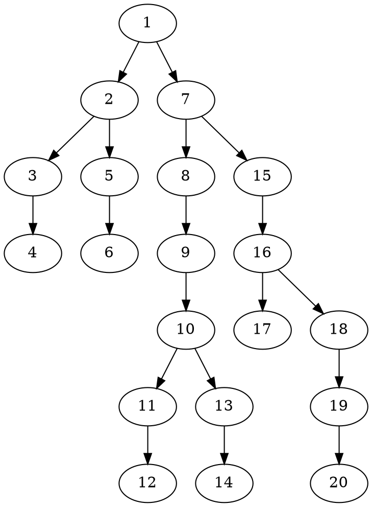

### Q 
Count nodes in a binary tree

#### A breadth first search approach , to initially just print a tree...
```clojure
(def tree {:id 1 :d 0 :l {:id 2 :d 1
                      :l {:id 3 :d 2
                          :l {:id 4 :d 3}}
                      :r {:id 5 :d 2
                          :r {:id 6 :d 3}}}
                  :r {:id 7 :d 1
                      :l {:id 8 :d 2
                          :l {:id 9 :d 3
                              :r {:id 10 :d 4
                                  :l {
                                      :id 11 :d 5
                                      :r {:id 12 :d 6}}
                                  :r {:id 13 :d 5
                                      :l {:id 14 :d 6}}}}}
                      :r {:id 15 :d 2
                          :l {:id 16 :d 3
                              :l {:id 17 :d 4}
                              :r {:id 18 :d 4
                                  :l {:id 19 :d 5
                                      :r {:id 20 :d 6}}}}}}

            })

(defn print-tree-breadth [tree]
  (when-not (nil? (get tree :id))
      (prn "i am " (get tree :id))
      (print-tree-breadth (get tree :l))
      (print-tree-breadth (get tree :r))
      ))
  
```
* this is what the traversal looks like 
```clojure
conquer.core=> (print-tree-breadth tree)
"i am " 1
"i am " 2
"i am " 3
"i am " 4
"i am " 5
"i am " 6
"i am " 7
"i am " 8
"i am " 9
"i am " 10
"i am " 11
"i am " 12
"i am " 13
"i am " 14
"i am " 15
"i am " 16
"i am " 17
"i am " 18
"i am " 19
"i am " 20
nil

```
* But it's hard to verify since heh I would need an alternate way to validate it is doing the right thing...
```clojure
(defn make-graphviz-tree-breadth [tree]
  (when-not (nil? (get tree :id))
      (when-not (nil? (get tree :l)) (println (get tree :id) " -> " (get-in tree [:l :id]) ";"))
      (when-not (nil? (get tree :r)) (println (get tree :id) " -> " (get-in tree [:r :id]) ";"))
      
      (make-graphviz-tree-breadth (get tree :l))
      (make-graphviz-tree-breadth (get tree :r))
      ))

```
```clojure
conquer.core=> (make-graphviz-tree-breadth tree)
1  ->  2 ;
1  ->  7 ;
2  ->  3 ;
2  ->  5 ;
3  ->  4 ;
5  ->  6 ;
7  ->  8 ;
7  ->  15 ;
8  ->  9 ;
9  ->  10 ;
10  ->  11 ;
10  ->  13 ;
11  ->  12 ;
13  ->  14 ;
15  ->  16 ;
16  ->  17 ;
16  ->  18 ;
18  ->  19 ;
19  ->  20 ;
nil
conquer.core=>

```
* making a graph from this now...

```bash
$  dot -Tpng -O  2019-05-08--tree.dot
# => produces this ...below  2019-05-08--tree.dot.png

```
* => 


