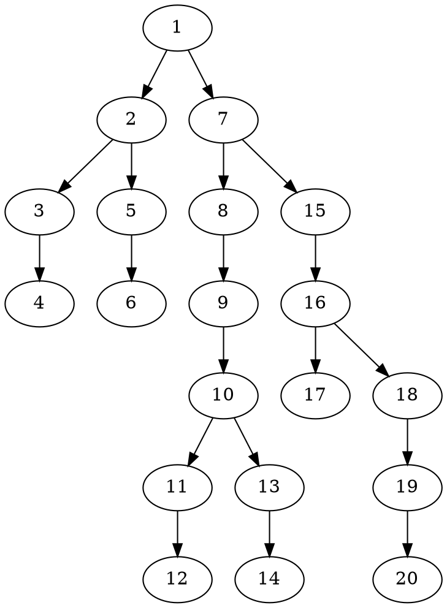

### Q 
Count nodes in a binary tree

#### A depth first search approach , to initially just print a tree...
* Just created this `map` based tree manually to use it...  
```clojure
(def tree {:id 1 :d 0 :l {:id 2 :d 1
                      :l {:id 3 :d 2
                          :l {:id 4 :d 3}}
                      :r {:id 5 :d 2
                          :r {:id 6 :d 3}}}
                  :r {:id 7 :d 1
                      :l {:id 8 :d 2
                          :l {:id 9 :d 3
                              :r {:id 10 :d 4
                                  :l {
                                      :id 11 :d 5
                                      :r {:id 12 :d 6}}
                                  :r {:id 13 :d 5
                                      :l {:id 14 :d 6}}}}}
                      :r {:id 15 :d 2
                          :l {:id 16 :d 3
                              :l {:id 17 :d 4}
                              :r {:id 18 :d 4
                                  :l {:id 19 :d 5
                                      :r {:id 20 :d 6}}}}}}

            })

(defn print-tree-depth [tree]
  (when-not (nil? (get tree :id))
      (prn "i am " (get tree :id))
      (print-tree-depth (get tree :l))
      (print-tree-depth (get tree :r))
      ))
  
```

##### this is what the traversal looks like 
```clojure
conquer.core=> (print-tree-depth tree)
"i am " 1
"i am " 2
"i am " 3
"i am " 4
"i am " 5
"i am " 6
"i am " 7
"i am " 8
"i am " 9
"i am " 10
"i am " 11
"i am " 12
"i am " 13
"i am " 14
"i am " 15
"i am " 16
"i am " 17
"i am " 18
"i am " 19
"i am " 20
nil

```

##### But it's hard to verify since heh I would need an alternate way to validate it is doing the right thing...
```clojure
(defn make-graphviz-tree-depth [tree]
  (when-not (nil? (get tree :id))
      (when-not (nil? (get tree :l)) (println (get tree :id) " -> " (get-in tree [:l :id]) ";"))
      (when-not (nil? (get tree :r)) (println (get tree :id) " -> " (get-in tree [:r :id]) ";"))
      
      (make-graphviz-tree-depth (get tree :l))
      (make-graphviz-tree-depth (get tree :r))
      ))

```
* Going to just make a quick Graphviz graph to make the visual validation eaiser.
```clojure
conquer.core=> (make-graphviz-tree-depth tree)
1  ->  2 ;
1  ->  7 ;
2  ->  3 ;
2  ->  5 ;
3  ->  4 ;
5  ->  6 ;
7  ->  8 ;
7  ->  15 ;
8  ->  9 ;
9  ->  10 ;
10  ->  11 ;
10  ->  13 ;
11  ->  12 ;
13  ->  14 ;
15  ->  16 ;
16  ->  17 ;
16  ->  18 ;
18  ->  19 ;
19  ->  20 ;
nil
conquer.core=>

```
* making a graph from this now...

```bash
$  dot -Tpng -O  2019-05-08--tree.dot
# => produces this ...below  2019-05-08--tree.dot.png

```
* => So looking at this output below here , and comparing to the [traversal output](#this-is-what-the-traversal-looks-like), 
this indeed looks like an accurate depth first traversal 


#### Okay now modify that code to answer the question, to count the nodes
```clojure
(defn count-nodes [tree]
  (if (nil? (get tree :id))
      1
      (+ (count-nodes (get tree :l))
         (count-nodes (get tree :r))))
)

conquer.core=> (count-nodes tree)
21
```
* Thats odd, `1` more than expected. hmm. 
* Going to add a print also.. for debugging...
```clojure
(defn count-nodes [tree]
  (if (nil? (get tree :id))
      (do (println (get tree :id)) 1)
      (+ (count-nodes (get tree :l))
         (count-nodes (get tree :r))))
)
conquer.core=> (count-nodes tree)
nil
nil
nil
nil
nil
nil
nil
nil
nil
nil
nil
nil
nil
nil
nil
nil
nil
nil
nil
nil
nil
21
```
* Oh wait crap lol it is actually counting the number of *negative space* nodes!! 
* Crap crap, yea just counted by hand there are `21` nodes that are missing , preventing this tree from being *complete*.

#### Count nodes, take two!
* How about, _If i'm nil, return 0, otherwise rurn 1 plus the counts of my children_... 
```clojure
(defn count-nodes-2 [tree]
  (if (nil? (get tree :id))
      0
      (do (println "me: " (get tree :id))

           (+ 1
             (count-nodes (get tree :l))
             (count-nodes (get tree :r)))
      )))
  
  
  
```


